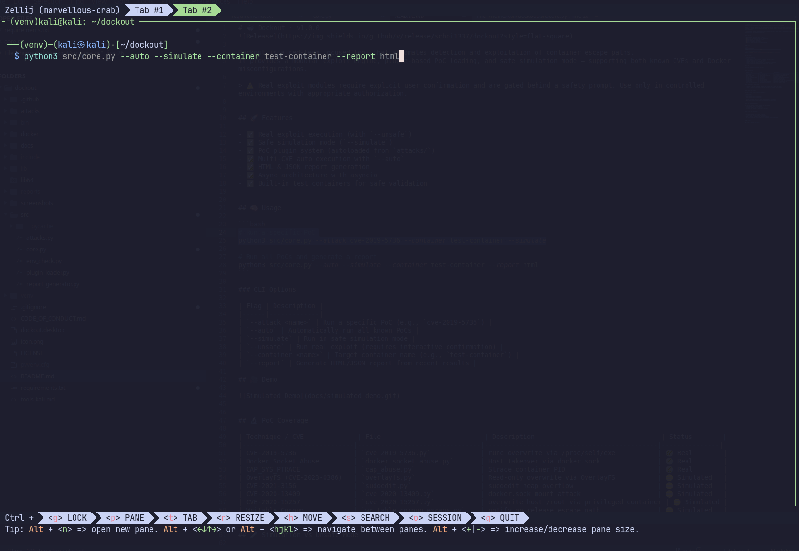

# 🐳 Dockout · v1.0.0


Dockout is a red-team focused tool that automates detection and exploitation of container escape paths.  
It provides a modular exploit engine, plugin-based PoC loading, and safe simulation mode — supporting both known CVEs and Docker misconfigurations.

> ⚠️ Ethical Use Disclaimer
This tool is intended strictly for authorized testing and research.
Do not use it against systems you do not own or have explicit permission to test.
The author assumes no responsibility for misuse or damage caused by this tool.


## 🚀 Features

- ✅ Real exploit execution (with `--unsafe`)
- ✅ Safe simulation mode (`--simulate`)
- ✅ PoC plugin system (autoloaded from `attacks/`)
- ✅ Multi-CVE auto execution with `--auto`
- ✅ HTML & JSON report generation
- ✅ Async architecture with asyncio
- ✅ Built-in test containers for safe validation


## 🧠 Usage

```bash
# Run a specific PoC
python3 src/core.py --attack cve-2019-5736 --container test-container --unsafe

# Run all PoCs in simulation mode and generate a report
python3 src/core.py --auto --simulate --container test-container --report html
```

### CLI Options

| Flag | Description |
|------|-------------|
| `--attack <name>` | Run a specific PoC (e.g., `cve-2019-5736`) |
| `--auto` | Automatically run all known PoCs |
| `--simulate` | Run in safe simulation mode |
| `--unsafe` | Run real exploit (requires interactive confirmation) |
| `--container <name>` | Target container name (e.g., `test-container`) |
| `--report` | Generate HTML/JSON report from recent results |

## 🎥 Demo




## 🔬 PoC Coverage

| Technique / CVE              | File                           | Description                                 | Status        |
|-----------------------------|--------------------------------|---------------------------------------------|---------------|
| CVE-2019-5736               | `cve_2019_5736.py`             | runc overwrite via /proc/self/exe           | 🟢 Real        |
| Docker Socket Abuse         | `docker_socket_abuse.py`       | Host takeover via docker.sock               | 🟢 Real        |
| CAP_SYS_PTRACE              | `cap_abuse.py`                 | Strace container PID                        | 🟢 Real        |
| OverlayFS (CVE-2023-0386)   | `overlayfs.py`                 | Read-only overwrite via OverlayFS           | 🟡 Simulated   |
| CVE-2021-3156               | `sudoedit.py`                  | sudoedit heap overflow                      | 🟡 Simulated   |
| CVE-2020-13409              | `cve_2020_13409.py`            | docker.sock mount attack                    | 🟡 Simulated   |
| CVE-2020-15257              | `cve_2020_15257.py`            | overwrite host /root via privileged container | 🟡 Simulated |
| Writable Cgroup             | `writable_cgroup_escape.py`    | notify_on_release escape path               | 🟡 Simulated   |
| Dirty Pipe (CVE-2022-0847)  | `dirty_pipe_escalation.py`     | overwrite readonly file                     | 🟡 Simulated   |

## 🧪 Simulation vs Unsafe Mode

- `--simulate`: No real filesystem changes; logs actions that **would** be taken.
- `--unsafe`: Executes real exploit logic with full effect (requires confirmation).
- Each PoC supports `simulate=True` and handles execution accordingly.


## 📂 Reports and Output

Results are saved in the `reports/` directory:

| Format | Path |
|--------|------|
| HTML | `reports/attack_report.html` |
| JSON | `reports/attack_report.json` |

- Includes: execution mode, risk level, recommendations, exploit logs  
- 📊 See sample: [`docs/sample_report.html`](docs/attack_report.html)


## 🧪 Safe Testing Containers

For each PoC, Dockout provides optional test containers:
- `/LEGIT_MARKER` check for clean state
- Pre-mounted targets for safe overwrite
- Stub setups for sudoedit / docker.sock / overlayfs


## ⚠️ Ethical Use Disclaimer

This tool is intended for authorized testing, research, and education only.

- Real-world exploits are disabled by default
- `--unsafe` mode requires explicit confirmation
- Never run against systems you do not own or control
- The author assumes no liability for misuse or damage caused by this tool

## ⚖️ Legal Disclaimer

Dockout is intended strictly for authorized testing and educational purposes.  
By using this tool, you agree that:

- You will not use it against systems you do not own or have explicit written permission to test.
- You understand that real exploit modules may cause permanent damage or system compromise.
- The author(s) of this tool assume **no responsibility for misuse, damage, or legal consequences**.

If you are unsure whether your usage is authorized — **do not run Dockout**.

## 📜 License

MIT License + Ethical Use Clause
